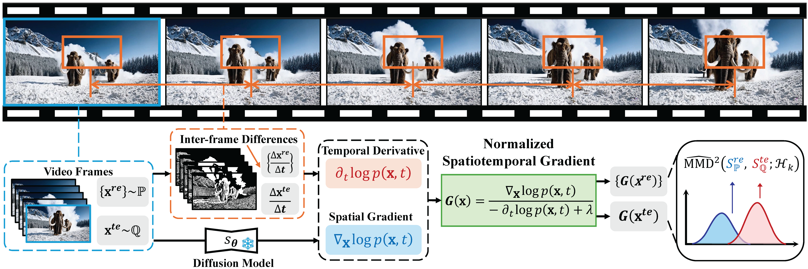

<h1 align="center">
     <br>Physics-Driven Spatiotemporal Modeling for AI-Generated Video Detection
<p align="center">
    <a href="https://openreview.net/forum?id=HiBoJLCyEo">
        
    </a>
</p>

<h4 align="center"></a>

>[Shuhai Zhang](), [ZiHao Lian](), [Jiahao Yang](), [Daiyuan Li](), [Guoxuan Pang](), [Feng Liu](), [Bo Han](), [Shutao Li](), [Mingkui Tan]()\
<sub>South China University of Technology, Pazhou Laboratory</sub>

<p align="center">
  
</p>

> **TL;DR:** NSG-VD leverages physics-driven spatiotemporal priors and diffusion-based gradient estimators to robustly detect AI-generated videos, achieving significant improvements over SOTA baselines.

## ✨ Abstract
AI-generated videos have achieved near-perfect visual realism (e.g., Sora), urgently necessitating reliable detection mechanisms. However, detecting such videos faces significant challenges in modeling high-dimensional spatiotemporal dynamics and identifying subtle anomalies that violate physical laws. In this paper, we propose a physics-driven AI-generated video detection paradigm based on probability flow conservation principles. Specifically, we propose a statistic called *Normalized Spatiotemporal Gradient* (NSG), which quantifies the ratio of spatial probability gradients to temporal density changes, explicitly capturing deviations from natural video dynamics. Leveraging pre-trained diffusion models, we develop an NSG estimator through spatial gradients approximation and motion-aware temporal modeling without complex motion decomposition while preserving physical constraints. Building on this, we propose an NSG-based video detection method (NSG-VD) that computes the *Maximum Mean Discrepancy* (MMD) between NSG features of the test and real videos as a detection metric. Last, we derive an upper bound of NSG feature distances between real and generated videos, proving that generated videos exhibit amplified discrepancies due to distributional shifts. Extensive experiments confirm that NSG-VD outperforms state-of-the-art baselines by 16.00% in Recall and 10.75% in F1-Score, validating the superior performance of NSG-VD.

## ⚙️ Requirements

- **GPU**: NVIDIA RTX 3090 (24GB) or better  
- **Disk**: ≥ 2.4 TB (GenVideo + extracted nsg features + checkpoints)
- **Models**: Pre-trained diffusion model [256x256_diffusion_uncond.pt](https://openaipublic.blob.core.windows.net/diffusion/jul-2021/256x256_diffusion_uncond.pt)  
- **Datasets**: [GenVideo](https://modelscope.cn/datasets/cccnju/Gen-Video), [Kinetics-400](https://github.com/cvdfoundation/kinetics-dataset) (val), [MSR-VTT](https://www.microsoft.com/en-us/research/publication/msr-vtt-a-large-video-description-dataset-for-bridging-video-and-language/)  


## 📂 Repository Structure
```bash
├── assets/                          # Resources for the experiments
│   ├── nsg-vd-test_results/         # Our nsg-vd test results
│   └── split.zip                    # Train/val/test split for GenVideo dataset
│
├── ckpts/                           # Pretrained NSG-VD checkpoints (released models)
├── configs/                         # Experiment configuration files
│
├── models/                          # Core model implementations
│   └── deep_mmd.py                  # NSG-VD detector (Deep MMD kernel)
│
├── data/                            # Dataset utilities
│   └── feature_dataset/             
│       └── score_feature_dataset.py # NSG feature dataset definition
│
├── train(test)_dMMD.py              # Train / Evaluate NSG-VD
├── train(test)_classifier.py        # Train / Evaluate baseline classifiers
```

## 🚀 Quick Start

1. **Clone the repo**
    ```bash
    git clone https://github.com/ZSHsh98/NSG-VD.git
    cd NSG-VD
    ```

2. **Create environment**
    ```bash
    conda create -n nsg-vd python=3.10 -y
    conda activate nsg-vd
    pip install -r requirements.txt
    ```

3. **Download pretrained diffusion model**

    Place `256x256_diffusion_uncond.pt` under `../Checkpoints/`

4. **Prepare datasets**
    - Download [GenVideo](https://modelscope.cn/datasets/cccnju/Gen-Video) (via [DeMamba](https://github.com/chenhaoxing/DeMamba)) to `../Data/GenVideo/fake/`
    - Download [Kinetics-400](https://github.com/cvdfoundation/kinetics-dataset) (val) and [MSR-VTT](https://www.microsoft.com/en-us/research/publication/msr-vtt-a-large-video-description-dataset-for-bridging-video-and-language/) to `../Data/GenVideo/real/`
    - Unzip [split.zip](./assets/split.zip) (included in repo) to `../Data/GenVideo/split/`
    - Expected structure:
        ```
        ../Data/GenVideo/
        ├── split/
        │   ├── fake
        │   └── real
        └── video/
            ├── fake/{Pika, SEINE, Sora, ...}
            └── real/{Kinetics-400, MSR-VTT}
        ```

        > ⚡ The training script will automatically extract frames and NSG features.  
        > ⏳ On a single NVIDIA RTX 3090, extracting NSG features for ~10,000 samples takes about **68.8 minutes**.  
        > After extracting, output will be organized as:  
        > ```
        > ../Data/GenVideo/
        > ├── nsg-vd/
        > │   └── STEPS_5/{fake, real} # NSG feautres (diffusion step = 5)
        > ├── split/{fake, real}
        > ├── video/{fake, real}
        > └── video_frames/{fake, real}
        > ```

## 🏆 Pretrained Models

We release pretrained **NSG-VD** checkpoints for reproducibility:

**Naming convention**:  `{task_type}-{generator}-{mmd_type}.pth`  
- `task_type`: standard / unbalance  
- `generator`: Pika / SEINE  
- `mmd_type`: d / mp

| **Setting**          | **Generator** | **Checkpoint Path**                |
|-----------------------|---------------|------------------------------------|
| Standard (MMD-MP)     | Pika          | `./ckpts/standard-Pika-mp.pth`     |
| Standard (MMD-MP)     | SEINE         | `./ckpts/standard-SEINE-mp.pth`    |
| Unbalanced (MMD-MP)   | SEINE         | `./ckpts/unbalance-SEINE-mp.pth`   |
| Standard (MMD-D)      | Pika          | `./ckpts/standard-Pika-d.pth`      |
| Standard (MMD-D)      | SEINE         | `./ckpts/standard-SEINE-d.pth`     |
| Unbalanced (MMD-D)    | SEINE         | `./ckpts/unbalance-SEINE-d.pth`    |

👉 All checkpoints are available in [`./ckpts/`](./ckpts).  
They correspond to the key experiments reported in our **NeurIPS 2025 paper**.


## ▶️ Usage
1. **Train NSG-VD on a specific AI-generated video source**
    ```bash
    # Example: Train with SEINE as generation source
    TASK_TYPE=standard # standard or unbalance
    GENERATOR=SEINE # Pika or SEINE

    # Train
    python train_dMMD.py \
        --config-path configs/nsg-vd-224x224 \
        --config-name standard.yaml \
        data.generation_model="$GENERATOR" \
        experiment_name="${TASK_TYPE}$-${GENERATOR}-mp" # default is mp with model.is_yy_zero=True
    ```

    - **MMD-D (model.is_yy_zero=False)**: optimizes intra-class distances for both real/fake; sensitive to diverse generators.
    - **MMD-MP (model.is_yy_zero=True)**: uses a multi-population proxy; more stable for diverse or unbalanced data.
    
    **Recommendation**: Use MMD-MP for multiple generators or unbalanced data; MMD-D only for single-generator, large-scale training.

2. **Evaluate on a test set**
    ```bash
    TASK_TYPE=standard # standard or unbalance
    GENERATOR=Pika # Pika or SEINE
    MMD_TYPE=d # d or mp
    CKPT_PATH="./ckpts/${TASK_TYPE}-${GENERATOR}-${MMD_TYPE}.pth" # our pretrained weights

    # Evaluate
    python test_dMMD.py \
        --config-path configs/nsg-vd-224x224 \
        --config-name test.yaml \
        ckpt_path=${CKPT_PATH} \
        log_path="./results/test/nsg-vd" \
        save_csv_file="${TASK_TYPE}-${GENERATOR}-mmd-${MMD_TYPE}.csv"
    ```

3. **Train & Evaluate Baselines**
    ```bash
    TASK_TYPE=standard # standard or unbalance
    GENERATOR=Pika # Pika or SEINE
    BASELINE=npr # support npr, demamba, stil and tall

    # Train
    python train_classifier.py \
        --config-path "configs/classifier-224x224/${BASELINE}" \
        --config-name ${TASK_TYPE}.yaml \
        data.generation_model="$GENERATOR" \
        experiment_name="${TASK_TYPE}-${GENERATOR}-${BASELINE}"

    # Evaluate
    python test_classifier.py \
        --config-path configs/classifier-224x224/${BASELINE} \
        --config-name test.yaml \
        ckpt_path=$CKPT_PATH \
        log_path="./results/test/baselines" \
        save_csv_file="${TASK_TYPE}-${GENERATOR}-${BASELINE}.csv"
    ```

## 📖 Citation
If you find our work useful, please consider citing:

```bibtex
@inproceedings{zhang2025NSGVD,
  title={Physics-Driven Spatiotemporal Modeling for AI-Generated Video Detection},
  author={Zhang, Shuhai and Lian, Zihao and Yang, Jiahao and Li, Daiyuan and Pang, Guoxuan and Liu, Feng and Han, Bo and Li, Shutao and Tan, Mingkui},
  booktitle={Advances in Neural Information Processing Systems},
  year={2025}
}
```

## 🙏 Acknowledgements
We gratefully acknowledge the following open-source contributions:  

- [Demamba](https://github.com/chenhaoxing/DeMamba) for baseline codebase
- [EPS-AD](https://github.com/ZSHsh98/EPS-AD) for difussion guided estimator

Our work builds upon these open-source efforts; we thank the authors for their valuable contributions.